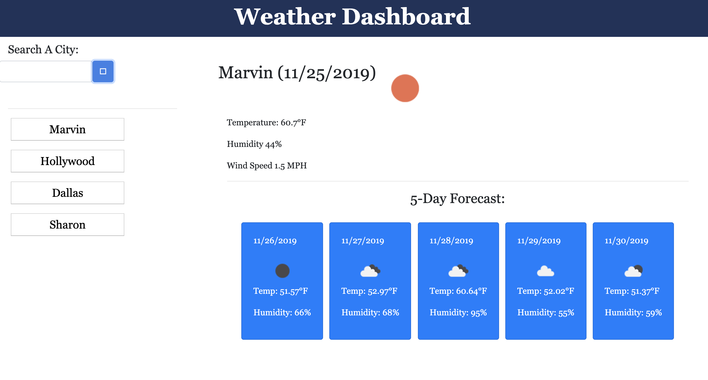

Weather Dashboard
---
A weather dashboard application with search functionality to find current weather conditions and the 5 Day Forecast for multiple cities.

Code Style
---
* HTML
* CSS
* Javascript
* jQuery

List of File
---
* index.html
* weather.js
* style.css

View of Dashboard
---

 
How to use
---
Enter a city name in the seach field.  The current date and weather will appear.  A 5 day forecast for the same city will be posted below the weather.  Your search history will be listed on the left side.  Click a recently searched city to see it's weather again.

The project source can be found at  https://sharonyel.github.io/weather_dashboard/

License
---
MIT License

Copyright (c) [2019] [Sharon Yelverton]

Permission is hereby granted, free of charge, to any person obtaining a copy of this software and associated documentation files (the "Software"), to deal in the Software without restriction, including without limitation the rights to use, copy, modify, merge, publish, distribute, sublicense, and/or sell copies of the Software, and to permit persons to whom the Software is furnished to do so, subject to the following conditions:

The above copyright notice and this permission notice shall be included in all copies or substantial portions of the Software.

THE SOFTWARE IS PROVIDED "AS IS", WITHOUT WARRANTY OF ANY KIND, EXPRESS OR IMPLIED, INCLUDING BUT NOT LIMITED TO THE WARRANTIES OF MERCHANTABILITY, FITNESS FOR A PARTICULAR PURPOSE AND NONINFRINGEMENT. IN NO EVENT SHALL THE AUTHORS OR COPYRIGHT HOLDERS BE LIABLE FOR ANY CLAIM, DAMAGES OR OTHER LIABILITY, WHETHER IN AN ACTION OF CONTRACT, TORT OR OTHERWISE, ARISING FROM, OUT OF OR IN CONNECTION WITH THE SOFTWARE OR THE USE OR OTHER DEALINGS IN THE SOFTWARE.
